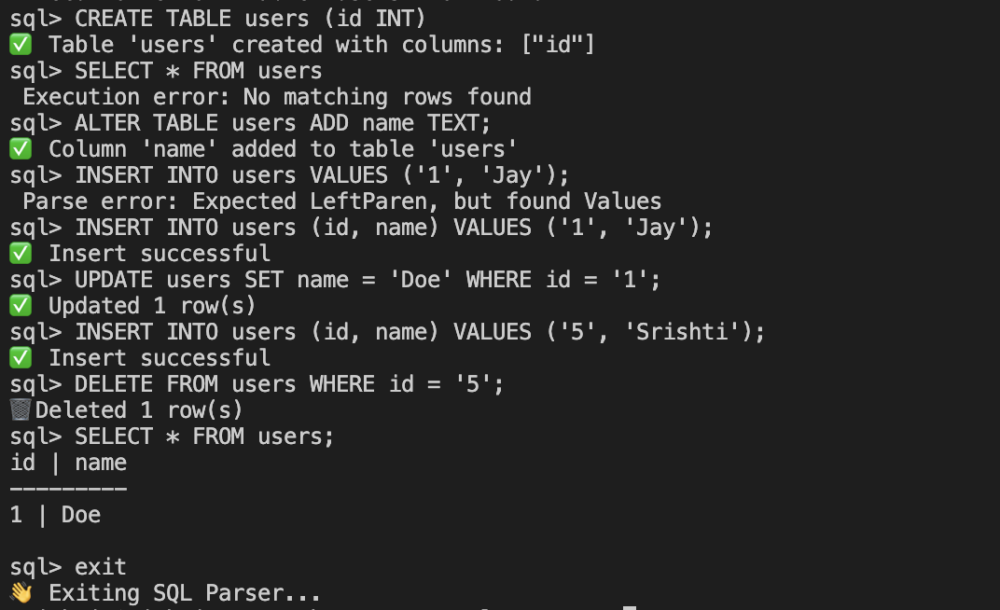

# rust_sql_parser
A Rust-based SQL query parser 
Run the following, after cloning:
- cargo build
- cargo run
- enter sql statements, for example the below implementation (ignore the warnings😬)
- give all the input( numbers, string literals) in single quotes ('')

update : implemented little, but check not done, throwing error, inprogress of resolving
implemented :
SELECT, INSERT, UPDATE, DELETE, CREATE TABLE, ALTER TABLE(ADD)

Next to do:
JOIN (INNER, LEFT, RIGHT, FULL) ,  ORDER BY,  GROUP BY,  HAVING,  LIMIT/OFFSET,  ALTER TABLE (DROP, MODIFY), DROP TABLE,  DISTINCT keyword in SELECT,  Aggregate Functions (SUM, COUNT, AVG, MIN, MAX)

